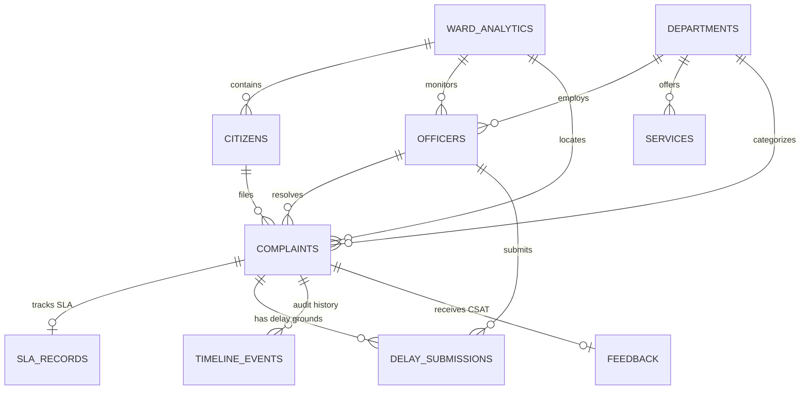

# 🏛️ GVMC AI-Based SLA Escalation & Civic Governance System
## Complete System Architecture, Codebase Tree, All 14 Database Models, Inputs & Outputs, Detailed Flowcharts & Technologies

---

## 1. 📂 Project File & Codebase Architecture

```
service complaint/
├── backend/                             # Python FastAPI Backend Layer
│   ├── app/
│   │   ├── main.py                      # FastAPI App Entry point & CORS Middleware setup
│   │   ├── core/                        # Database Engine & Security Utilities
│   │   │   ├── config.py                # Environment Variables & Configs
│   │   │   ├── database.py              # SQLite Connection, Session Maker & Data Seeder
│   │   │   └── security.py              # Passlib Hashing & JWT Auth Token Utilities
│   │   ├── models/                      # SQLAlchemy Relational ORM Models (All 14 Models)
│   │   │   └── models.py                # WardAnalytics, Citizen, Officer, Department, Service, Complaint, etc.
│   │   ├── schemas/                     # Pydantic Request/Response Validation DTOs
│   │   │   └── schemas.py               # Data Transfer Schemas for FastAPI Endpoints
│   │   ├── api/                         # FastAPI REST Route Controllers
│   │   │   ├── auth.py                  # Login, Citizen Registration & Auth APIs
│   │   │   ├── complaints.py            # Complaint Lifecycle & Ward Routing APIs
│   │   │   ├── notifications.py         # Multi-Channel Alert Dispatch & Fetch APIs
│   │   │   ├── admin.py                 # Admin Governance Actions & Workload Balancer APIs
│   │   │   ├── dashboard.py             # Executive City Metrics & SLA Analytics APIs
│   │   │   └── officers.py              # Manager Directory & Monthly Performance APIs
│   │   └── services/                    # Core Business Logic & AI Engines
│   │       ├── ai_nlp_service.py        # Voice STT (Whisper) & Telugu NLP Translation
│   │       ├── escalation_engine.py     # Real-Time SLA Breach Evaluator & Auto-Escalation Engine
│   │       └── notification_service.py  # SMS / Email / Dashboard Alert Dispatch Service
│   └── requirements.txt                 # Backend Python Dependencies
│
├── frontend/                            # React 18 + Vite Frontend Layer
│   ├── src/
│   │   ├── main.jsx                     # React Root Mounting Point
│   │   ├── App.jsx                      # React Router Routing & Protected Role Routes
│   │   ├── index.css                    # TailwindCSS Directives & Dark Mode Tokens
│   │   ├── context/                     # Global React Context Providers
│   │   │   ├── AuthContext.jsx          # User Session State & Auth Handlers
│   │   │   └── LanguageContext.jsx      # i18n Multilingual Dictionary Provider (EN/TE/HI)
│   │   ├── services/                    # Axios REST API Client
│   │   │   └── api.js                   # Centralized Axios REST Endpoints
│   │   ├── components/                  # Reusable UI Component Library
│   │   │   ├── Navbar.jsx               # Header Navigation Bar
│   │   │   ├── SLATimer.jsx             # Live SLA Countdown & Overdue Counter Component
│   │   │   ├── TeluguVoiceRecorder.jsx  # Telugu Audio Recorder & AI STT Trigger
│   │   │   ├── CitizenChatbot.jsx       # Interactive Citizen Rights Assistant
│   │   │   ├── MapPicker.jsx            # GIS Leaflet Map Location Coordinate Picker
│   │   │   └── NotificationDrawer.jsx   # Slide-over Real-Time Notification Drawer
│   │   └── pages/                       # Portal Role View Pages
│   │       ├── LoginRegister.jsx        # Authentication & Role Switcher Page
│   │       ├── CitizenPortal.jsx        # Citizen Complaint Registration & Tracking Desk
│   │       ├── OfficerPortal.jsx        # Ward Manager Dispatch & Delay Explanation Desk
│   │       ├── AdminPortal.jsx          # Admin Console, Workload Balancer & Delay Review
│   │       ├── CommissionerPortal.jsx   # Commissioner Executive Oversight & Escalation Desk
│   │       └── ComplaintDetails.jsx     # Step-by-Step Audit Timeline View Page
│   └── package.json                     # Frontend Node.js Dependencies
│
└── tests/                               # Automated Test Suite
    ├── test_sla_escalation_system.py   # SLA Timer & Auto-Escalation Test Suite
    └── verify_notifications.py          # Multi-Channel Notification Test Suite
```

---

## 2. 📥 Inputs & 📤 Outputs Breakdown Matrix

### 📥 **Comprehensive System Inputs**

| Portal / Module | Input Type | Input Description & Format | Destination Component |
| :--- | :--- | :--- | :--- |
| **Citizen Portal** | **Voice Audio** | Speech audio recorded in Telugu, Hindi, or English (WAV/WEBM). | `OpenAI Whisper STT` & `ai_nlp_service.py` |
| **Citizen Portal** | **Text Form** | Complaint title, detailed text description, and priority level. | `complaints.py` FastAPI endpoint |
| **Citizen Portal** | **GIS Map Coordinates** | Latitude & Longitude selected via Leaflet map pin drop. | `MapPicker.jsx` & `complaints` DB table |
| **Citizen Portal** | **Ward Selection** | Selection of target Municipal Ward (`WARD-01` to `WARD-05`). | `Ward Allocation Algorithm` |
| **Citizen Portal** | **Media Upload** | Image photo or video proof attachment. | `python-multipart` backend handler |
| **Citizen Portal** | **CSAT Feedback** | 1-to-5 Star rating and resolution review comments. | `citizen_feedbacks` DB table |
| **Ward Manager Desk** | **Status Change** | Status update toggle (`IN_PROGRESS`, `RESOLVED`). | `OfficerPortal.jsx` & `complaints.py` |
| **Ward Manager Desk** | **Work Notes** | Resolution notes recorded by maintenance field team. | `complaints.resolution_notes` field |
| **Ward Manager Desk** | **Delay Explanation** | Delay reason category (Heavy rainfall, material shortage, etc.), promised completion timestamp, and remarks. | `DelayReasonSubmission` DB model |
| **Admin Console** | **Re-allocation** | Selecting new Ward Manager to reassign ticket workload. | `admin.py` reassign controller |
| **Admin Console** | **Admin Decision** | Review decision on delay explanation (`ACCEPT`, `REJECT`, `EXTEND SLA`, `REASSIGN`, `ESCALATE`). | `admin.py` review controller |

---

### 📤 **Comprehensive System Outputs**

| Portal / Module | Output Type | Output Description & Format | Target Recipient / View |
| :--- | :--- | :--- | :--- |
| **SLA Timer Module** | **Live Countdown** | Green/Amber countdown (`03h 45m 12s remaining`) showing time before SLA breach. | Citizen & Manager UI cards |
| **SLA Timer Module** | **Overdue Counter** | Red overdue counter (`+00h 02m 15s overdue`) showing elapsed overdue time post-breach. | All Portals & Notification Drawer |
| **Notification Engine** | **SMS Alert** | Short Message Service text dispatch logging SLA breach or status update. | Citizen & Officer Mobile Phone |
| **Notification Engine** | **Email Alert** | HTML email dispatch with ticket details and escalation warning wording. | Citizen, Officer & Admin Email |
| **Notification Engine** | **In-App Notification** | Slide-over drawer notification cards with breach warning badges. | `NotificationDrawer.jsx` |
| **Commissioner Desk** | **Escalation Desk** | Direct red banner alert for severe tickets unaddressed 1 hour post-breach. | `CommissionerPortal.jsx` |
| **Admin Console** | **Workload Plan** | Recommended manager workload redistribution plan (%) based on capacity. | `AdminPortal.jsx` |
| **Audit Log Engine** | **Timeline Trail** | Step-by-step chronological audit history log recording every event, timestamp, and actor. | `ComplaintDetails.jsx` |

---

## 3. 🔄 Detailed Complaint Registration-to-Feedback Execution Sequence Flow

```
Citizen submits complaint
          │
          ▼
Authentication (Users Table)
          │
          ▼
Complaint stored
          │
          ▼
Department selected (using AI + SLA Dataset)
          │
          ▼
Check Manager Availability (Single Problem Capacity: active_workload == 0)
          │
      ┌───┴────────────────────────┐
      ▼                            ▼
[Manager Available]     [All Managers Busy]
      │                            │
Assign Manager            Set Status -> PENDING
Set Status -> ASSIGNED    Add to Queue
      │                            │
      ├────────────────────────────┘
      ▼
Timeline & SLA Timer Started
          │
          ▼
Officer Resolves Complaint -> Workload = 0
          │
          ▼
Auto-Dispatch Engine assigns next PENDING complaint from Queue to Manager
          │
          ▼
Citizen Feedback stored
```

---

## 4. ⚡ Comprehensive End-to-End SLA Escalation & Single-Task Allocation Workflow

```
[1. Citizen files complaint via Voice AI / Form]
                         │
                         ▼
[2. AI converts Telugu Voice -> English & detects Department]
                         │
                         ▼
[3. Single-Task Allocator checks available Manager (active_workload == 0)]
                         │
           ┌─────────────┴─────────────┐
           ▼                           ▼
[Manager Available]           [All Managers Busy]
           │                           │
  [Status -> ASSIGNED]        [Status -> PENDING Queue]
  [Workload = 1]                       │
           │                     [Waiting in Queue]
           ▼                           │
[4. Start SLA Timer]                   │
           │                           │
           ▼                           │
[5. Manager Resolves Problem]          │
           │                           │
  [Workload -> 0]                      │
           │                           │
           └───────────┬───────────────┘
                       ▼
    [Auto-Dispatch Engine assigns queued ticket]
                       │
                       ▼
       [Time Limit Exceeded Alert & Escalation]
```

---

## 5. 🗄️ Database Architecture & Complete Model Inventory (All 14 Models)



---

## 6. 🛠️ Complete Technology Stack & Tooling Inventory

### 💻 **Frontend Technologies**

| Technology / Package | Category | Version | Role & Purpose in Project |
| :--- | :--- | :--- | :--- |
| **React 18** | UI Framework | `^18.2.0` | Component-based interactive User Interface for Citizen, Manager, Admin, and Commissioner portals. |
| **Vite** | Build Tool | `^4.5.0` | Lightning-fast development server with Hot Module Replacement (HMR) for instant code updates. |
| **TailwindCSS** | CSS Design System | `^3.3.5` | Standardized styling framework powering the sleek all-black dark mode layout and glassmorphism UI. |
| **React Router DOM** | Client Routing | `^6.18.0` | Single Page Application (SPA) navigation and role-based route authorization. |
| **Axios** | HTTP Client | `^1.6.0` | Asynchronous REST API integration with FastAPI backend endpoints. |
| **Leaflet / React-Leaflet** | GIS Mapping | `^1.9.4` / `^4.2.1` | Interactive map pin dropping for accurate geospatial location tagging of civic issues. |
| **Lucide React** | Icon Library | `^0.292.0` | SVG icons for status badges, SLA timers, notifications, and navigation links. |

---

### ⚙️ **Backend Technologies**

| Technology / Package | Category | Version | Role & Purpose in Project |
| :--- | :--- | :--- | :--- |
| **FastAPI** | Web Framework | `>=0.104.0` | High-performance Python REST API gateway handling async endpoints and OpenAPI documentation. |
| **Uvicorn** | ASGI Web Server | `>=0.23.2` | Production-grade ASGI server running FastAPI backend on `http://127.0.0.1:8000`. |
| **SQLAlchemy** | Database ORM | `>=2.0.22` | Object-Relational Mapping for Python models, foreign key relationships, and transactions. |
| **SQLite** | RDBMS Database | Built-in | Lightweight relational database storing all 14 database models (`complaints.db`). |
| **Pydantic v2** | Data Validation | `>=2.4.2` | Strict request/response Data Transfer Object (DTO) validation schemas. |
| **PyJWT** | Authentication | `>=2.8.0` | JSON Web Token generation and user authentication verification. |
| **Passlib (Bcrypt)** | Security | `>=1.7.4` | Password hashing and salt verification for secure user authentication. |
| **Scikit-learn & XGBoost** | Machine Learning | `>=1.3.1` / `>=2.0.0` | ML algorithms for SLA breach risk prediction scoring and department classification. |
| **Pandas & NumPy** | Data Science | `>=2.1.1` / `>=1.26.0` | Data processing, statistical analytics, and ward risk metrics calculation. |
| **OpenAI Whisper (STT)** | Speech AI | Service | Converts Telugu & Hindi speech recordings into text transcripts. |

---
